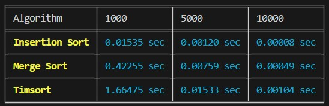

# woolf-algo-hw-04

Python має дві вбудовані функції сортування: sorted і sort. 
Функції сортування Python використовують Timsort — гібридний алгоритм сортування, 
що поєднує в собі сортування злиттям і сортування вставками.

Порівняйте три алгоритми сортування: злиттям, вставками та Timsort за часом виконання. 
Аналіз повинен бути підтверджений емпіричними даними, отриманими шляхом тестування алгоритмів на різних наборах даних. 
Емпірично перевірте теоретичні оцінки складності алгоритмів, наприклад, сортуванням на великих масивах. 
Для заміру часу виконання алгоритмів використовуйте модуль timeit.

Покажіть, що поєднання сортування злиттям і сортування вставками робить алгоритм Timsort набагато ефективнішим, 
і саме з цієї причини програмісти, в більшості випадків, використовують вбудовані в Python алгоритми, 
а не кодують самі. Зробіть висновки.

Дано k відсортованих списків цілих чисел. 
Завдання — об'єднати їх у один відсортований список. 
При виконанні завдання можете опиратися на алгоритм сортування злиттям з конспекту. 
Реалізуйте функцію merge_k_lists , яка приймає на вхід список відсортованих списків та повертає відсортований список.

 

